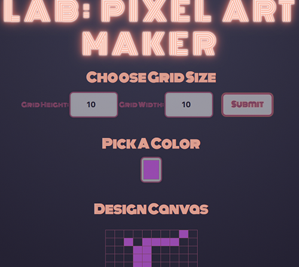

# Description

[Github Source](https://github.com/northantsvintage/fewd-pixel-art-maker/)

[Demo](https://northantsvintage.github.io/fewd-pixel-art-maker/index.html)

# Skills

  - jQuery
  - UX Design

Drawing application

Using DOM selectors and event listeners, drawing app that allows users to create their own pixel art
