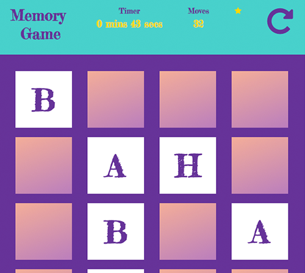

# Description

[Github Source](https://github.com/northantsvintage/fend-project-memory-game/)

[Demo](https://northantsvintage.github.io/fend-project-memory-game/)

Classic Memory game "Concentration" using JavaScript, DOM, Event Listeneres, HTML5.

The way I apporached this project was to break it down into small pieces of work.
- I started by building a grid of cards
- Adding the functionality to handle clicks
- Matching logic
- Creating winning condition
- Adding additional functionality: move counter, timer, star rating and reset button
- Styling the app