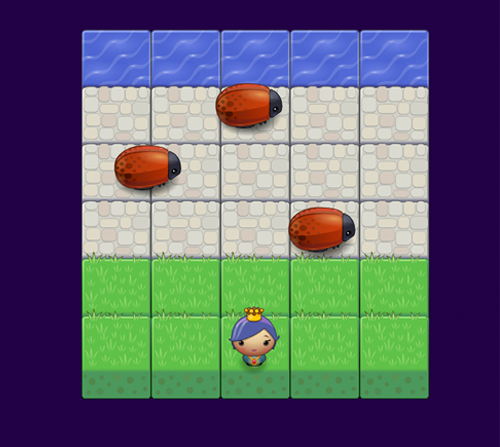

# Description

[Github Source](https://github.com/northantsvintage/frontend-nanodegree-arcade-game/)

[Demo](https://northantsvintage.github.io/frontend-nanodegree-arcade-game/)

This was Arcade Game Clone. Provided with visual assets and game loop engine, implemented functionalities in order to play the game. Game was programmed using Object Oriented Javascript programming principles and HTML5 Canvas.
In this game you have a Player and Enemies (bugs). The goal of the player is to reach the water, without colliding into any one of the enemies.

The player can move left, right, up and down
The enemies move at varying speeds on the paved block portion of the game board
Once a the player collides with an enemy, the game is reset and the player moves back to the starting square
Once the player reaches the water (i.e., the top of the game board), the game is won