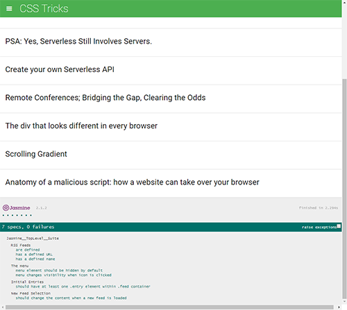

# Description

[Github Source](https://github.com/northantsvintage/frontend-nanodegree-feedreader)

Writing testing feeds.
- allFeeds to make the provided test fail
- test that loops through each feed in the allFeeds object and ensures it has a URL defined and that the URL is not empty
- test that loops through each feed in the allFeeds object and ensures it has a name defined and that the name is not empty
- test suite named "The menu"
- test that ensures the menu element is hidden by default
- test suite: "Initial Entries", "loadFeed", "New Feed Selection"