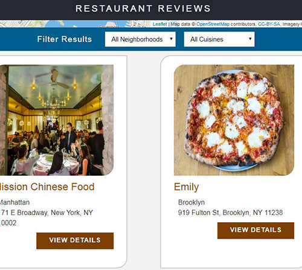

# Description

[Github Source](https://github.com/northantsvintage/restaurant-review-app-project/)

[Demo](https://flamboyant-lalande-c04e65.netlify.com/)

 Convert a static webpage to a mobile-ready web application with offline capability.
 Static design that lacks accessibility and converting it to the design to be responsive on different sized displays and accessible for screen reader use and making it Progressive Web Application by caching some assets for offline use. ServiceWorker script to cache requests to all of the site’s assets (so that any page that has been visited by a user will be accessible when the user is offline)