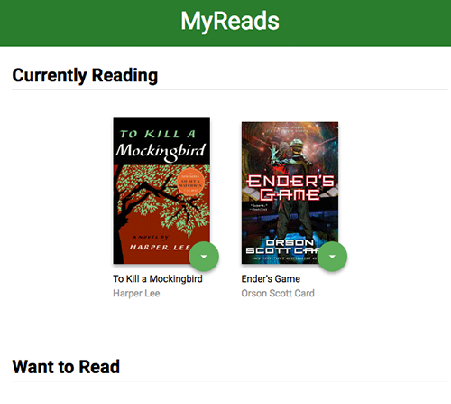

# Description

[Github Source](https://github.com/northantsvintage/myreads-react-frontend)

[Demo](https://modest-gates-98f432.netlify.com/)

React project to manage books on shelves
App that allows you to select and categorize books you have read, are currently reading, or want to read